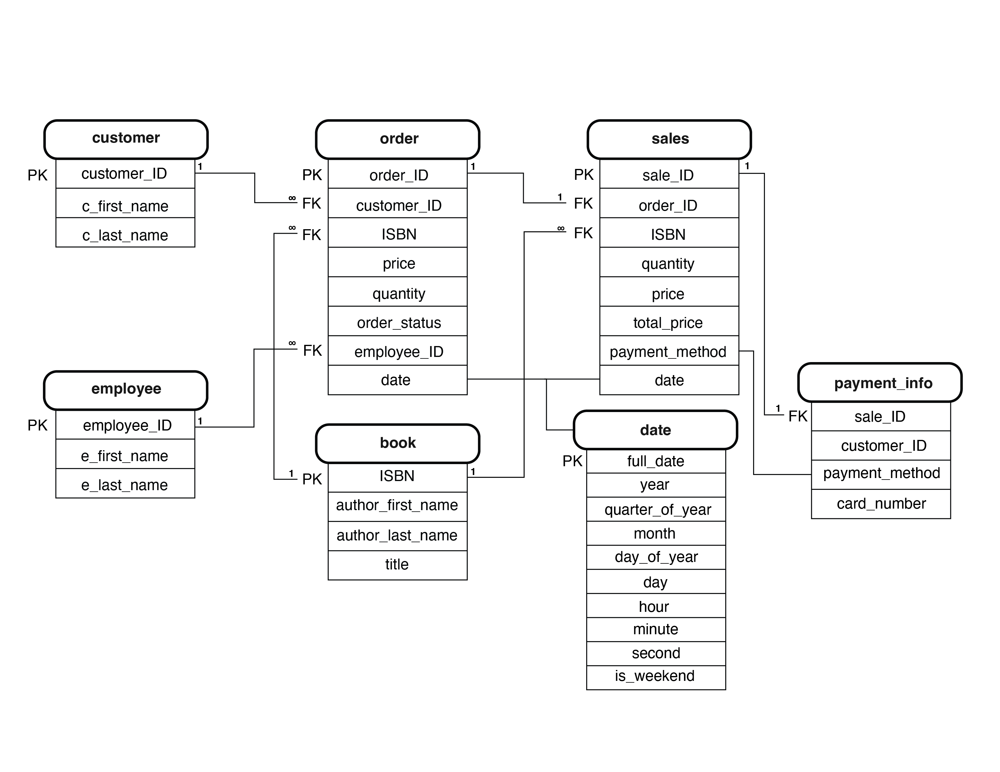
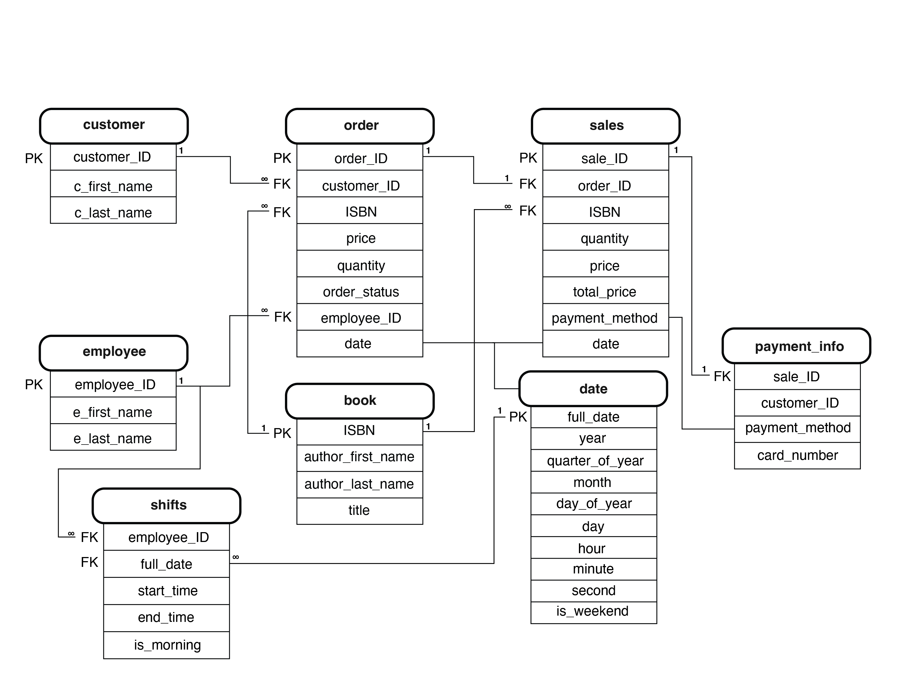

# DC Assignment 2: Design a Logical Model and Advanced SQL

🚨 **Please review our [Assignment Submission Guide](https://github.com/UofT-DSI/onboarding/blob/main/onboarding_documents/submissions.md)** 🚨 for detailed instructions on how to format, branch, and submit your work. Following these guidelines is crucial for your submissions to be evaluated correctly.

#### Submission Parameters:
* Submission Due Date: `April 07, 2026`
* Weight: 70% of total grade
* The branch name for your repo should be: `assignment-two`
* What to submit for this assignment:
    * This markdown (Assignment2.md) with written responses in Section 1 and 4
    * Two Entity-Relationship Diagrams (preferably in a pdf, jpeg, png format).
    * One .sql file 
* What the pull request link should look like for this assignment: `https://github.com/<your_github_username>/sql/pulls/<pr_id>`
    * Open a private window in your browser. Copy and paste the link to your pull request into the address bar. Make sure you can see your pull request properly. This helps the technical facilitator and learning support staff review your submission easily.

Checklist:
- [ ] Create a branch called `assignment-two`.
- [ ] Ensure that the repository is public.
- [ ] Review [the PR description guidelines](https://github.com/UofT-DSI/onboarding/blob/main/onboarding_documents/submissions.md#guidelines-for-pull-request-descriptions) and adhere to them.
- [ ] Verify that the link is accessible in a private browser window.

If you encounter any difficulties or have questions, please don't hesitate to reach out to our team via our Slack. Our Technical Facilitators and Learning Support staff are here to help you navigate any challenges.

***

## Section 1:
You can start this section following *session 1*, but you may want to wait until you feel comfortable wtih basic SQL query writing. 

Steps to complete this part of the assignment:
- Design a logical data model
- Duplicate the logical data model and add another table to it following the instructions
- Write, within this markdown file, an answer to Prompt 3


###  Design a Logical Model

#### Prompt 1
Design a logical model for a small bookstore. 📚

At the minimum it should have employee, order, sales, customer, and book entities (tables). Determine sensible column and table design based on what you know about these concepts. Keep it simple, but work out sensible relationships to keep tables reasonably sized. 

Additionally, include a date table. 
A date table (also called a calendar table) is a permanent table containing a list of dates and various components of those dates. Some theory, tips, and commentary can be found [here](https://www.sqlshack.com/designing-a-calendar-table/), [here](https://www.mssqltips.com/sqlservertip/4054/creating-a-date-dimension-or-calendar-table-in-sql-server/) and [here](https://sqlgeekspro.com/creating-calendar-table-sql-server/). 
Remember, you don't actually need to run any of the queries in these articles, but instead understand *why* date tables in SQL make sense, and how to situate them within your logical models.

There are several tools online you can use, I'd recommend [Draw.io](https://www.drawio.com/) or [LucidChart](https://www.lucidchart.com/pages/).

**HINT:** You do not need to create any data for this prompt. This is a conceptual model only. 



#### Prompt 2
We want to create employee shifts, splitting up the day into morning and evening. Add this to the ERD.


#### Prompt 3
The store wants to keep customer addresses. Propose two architectures for the CUSTOMER_ADDRESS table, one that will retain changes, and another that will overwrite. Which is type 1, which is type 2? 

**HINT:** search type 1 vs type 2 slowly changing dimensions. 

```
Slowly Changing Dimensions (SCD) will allow for the historical data to either be preserved or overwritten as customer addresses are updated in the customer database. 

Type 1 SCD overwrites the previous value. So in this case, the new customer address would overwrite the old one, and no past information would be saved, and therefore no historical data analysis would be possible. The benefits of this approach is that is needs a lower amount of storage, and there is only one address attached to each customer ID, however, it could pose issues with tracking past order history. 

TYPE 1 CUSTOMER_ADDRESS TABLE:
customer_ID
street address
city
province
country
postal code
date_updated


Type 2 SCD adds a new row with the new value and therefore retains the historical value. This will allow for the full customer address history to be retained and accessed over time. This method takes up more storage, and needs more organization as there will sometimes be multiple addresses attached to a customer ID. However, it also allows for historical and geographical analysis of sales, as well as investigation of past order addresses. 

TYPE 2 CUSTOMER_ADDRESS TABLE:
customer_ID
street address
city
province
country
postal code
start_date
end_date
date_updated
current_address (BOOLEAN)


```

***

## Section 2:
You can start this section following *session 4*.

Steps to complete this part of the assignment:
- Open the assignment2.sql file in DB Browser for SQLite:
	- from [Github](./02_activities/assignments/assignment2.sql)
	- or, from your local forked repository  
- Complete each question, by writing responses between the QUERY # and END QUERY blocks


### Write SQL

#### COALESCE
1. Our favourite manager wants a detailed long list of products, but is afraid of tables! We tell them, no problem! We can produce a list with all of the appropriate details. 

Using the following syntax you create our super cool and not at all needy manager a list:
```
SELECT 
product_name || ', ' || product_size|| ' (' || product_qty_type || ')'
FROM product
```

But wait! The product table has some bad data (a few NULL values). 
Find the NULLs and then using COALESCE, replace the NULL with a blank for the first column with nulls, and 'unit' for the second column with nulls. 

**HINT**: keep the syntax the same, but edited the correct components with the string. The `||` values concatenate the columns into strings. Edit the appropriate columns -- you're making two edits -- and the NULL rows will be fixed. All the other rows will remain the same.

<div align="center">-</div>

#### Windowed Functions
1. Write a query that selects from the customer_purchases table and numbers each customer’s visits to the farmer’s market (labeling each market date with a different number). Each customer’s first visit is labeled 1, second visit is labeled 2, etc. 

You can either display all rows in the customer_purchases table, with the counter changing on each new market date for each customer, or select only the unique market dates per customer (without purchase details) and number those visits. 

**HINT**: One of these approaches uses ROW_NUMBER() and one uses DENSE_RANK().

Filter the visits to dates before April 29, 2022.

2. Reverse the numbering of the query so each customer’s most recent visit is labeled 1, then write another query that uses this one as a subquery (or temp table) and filters the results to only the customer’s most recent visit. 
**HINT**: Do not use the previous visit dates filter.

3. Using a COUNT() window function, include a value along with each row of the customer_purchases table that indicates how many different times that customer has purchased that product_id.

You can make this a running count by including an ORDER BY within the PARTITION BY if desired.
Filter the visits to dates before April 29, 2022.

<div align="center">-</div>

#### String manipulations
1. Some product names in the product table have descriptions like "Jar" or "Organic". These are separated from the product name with a hyphen. Create a column using SUBSTR (and a couple of other commands) that captures these, but is otherwise NULL. Remove any trailing or leading whitespaces. Don't just use a case statement for each product! 

| product_name               | description |
|----------------------------|-------------|
| Habanero Peppers - Organic | Organic     |

**HINT**: you might need to use INSTR(product_name,'-') to find the hyphens. INSTR will help split the column. 

2. Filter the query to show any product_size value that contain a number with REGEXP. 

<div align="center">-</div>

#### UNION
1. Using a UNION, write a query that displays the market dates with the highest and lowest total sales.

**HINT**: There are a possibly a few ways to do this query, but if you're struggling, try the following: 1) Create a CTE/Temp Table to find sales values grouped dates; 2) Create another CTE/Temp table with a rank windowed function on the previous query to create "best day" and "worst day"; 3) Query the second temp table twice, once for the best day, once for the worst day, with a UNION binding them. 

***

## Section 3:
You can start this section following *session 5*.

Steps to complete this part of the assignment:
- Open the assignment2.sql file in DB Browser for SQLite:
	- from [Github](./02_activities/assignments/assignment2.sql)
	- or, from your local forked repository  
- Complete each question, by writing responses between the QUERY # and END QUERY blocks

### Write SQL

#### Cross Join
1. Suppose every vendor in the `vendor_inventory` table had 5 of each of their products to sell to **every** customer on record. How much money would each vendor make per product? Show this by vendor_name and product name, rather than using the IDs.

**HINT**: Be sure you select only relevant columns and rows. Remember, CROSS JOIN will explode your table rows, so CROSS JOIN should likely be a subquery. Think a bit about the row counts: how many distinct vendors, product names are there (x)? How many customers are there (y). Before your final group by you should have the product of those two queries (x\*y). 

<div align="center">-</div>

#### INSERT
1. Create a new table "product_units". This table will contain only products where the `product_qty_type = 'unit'`. It should use all of the columns from the product table, as well as a new column for the `CURRENT_TIMESTAMP`.  Name the timestamp column `snapshot_timestamp`.

2. Using `INSERT`, add a new row to the product_unit table (with an updated timestamp). This can be any product you desire (e.g. add another record for Apple Pie). 

<div align="center">-</div>

#### DELETE 
1. Delete the older record for the whatever product you added.

**HINT**: If you don't specify a WHERE clause, [you are going to have a bad time](https://imgflip.com/i/8iq872).

<div align="center">-</div>

#### UPDATE
1. We want to add the current_quantity to the product_units table. First, add a new column, `current_quantity` to the table using the following syntax.
```
ALTER TABLE product_units
ADD current_quantity INT;
```

Then, using `UPDATE`, change the current_quantity equal to the **last** `quantity` value from the vendor_inventory details. 

**HINT**: This one is pretty hard. First, determine how to get the "last" quantity per product. Second, coalesce null values to 0 (if you don't have null values, figure out how to rearrange your query so you do.) Third, `SET current_quantity = (...your select statement...)`, remembering that WHERE can only accommodate one column. Finally, make sure you have a WHERE statement to update the right row, you'll need to use `product_units.product_id` to refer to the correct row within the product_units table. When you have all of these components, you can run the update statement.
*** 

## Section 4:
You can start this section anytime.

Steps to complete this part of the assignment:
- Read the article
- Write, within this markdown file, between 250 and 1000 words. No additional citations/sources are required.

### Ethics

Read: Boykis, V. (2019, October 16). _Neural nets are just people all the way down._ Normcore Tech. <br>
    https://vicki.substack.com/p/neural-nets-are-just-people-all-the

**What are some of the ethical issues important to this story?**

Consider, for example, concepts of labour, bias, LLM proliferation, moderating content, intersection of technology and society, ect. 


```
Sorry about this! I totally missed this once I started to work on the SQL section.
My thoughts:

To be honest, this article had me feeling a bit existential about the entire point or end goal of AI implementation. The use of AI, especially LLMs, has been a huge topic of discussion with my committee members and I over the past year. We’ve settled on me committing not to use AI in the writing of my dissertation at all, both for concerns about my cognitive development and expertise, but also concerns regarding intellectual property in an ever-evolving data surveillance landscape.

The more I learn about AI systems operate, the more troubling these concerns become. Much of AI applications rely on the exploitation of human labour for profit (e.g., in this article, the labour used for labelling images; or the use of online books to train LLMs), I question what the overall purpose of the technology is. It clearly devalues human labour, especially creative practices such as writing or art, and for what, the sake of efficiency? I continue to come back to what I tell my writing students: “why would I want to read something that someone did not write?” 

As I continue to be involved in the administration of writing-centred undergraduate courses, evidence supporting my concerns grow. I’ve recently worked in a course that’s transitioned to all in-person writing exercises and we can see that students are seriously struggling with writing practices. When LLMs have been used to generate their assignments through their adolescent years, there is a clear lack of reading and writing skills manifesting when they are required to think and elucidate their ideas on the spot. 

Furthermore, when LLMs are used to complete course assignments, its biases are infused in = the summaries they’re generating to work from as well as the writing they are submitting. Rather than fostering critical engagement or encouraging originality in thought, the practice is moving academic work towards homogeneity. Then, when we think longer term about the data and content that AI systems will continue to be trained upon, I’m left wondering how human knowledge will continue to evolve, as human ingenuity and imagination has long been the key to discovery and the future of research. 

All that to say, I don’t have a solution to any of these thoughts, but I keep thinking about the robot folding towels, and I wonder what the point is of training robots to do something that we have mastered. I think about consumer products such as the NEO robot. As humans, we have long mastered caregiving and mutual support. But now, by introducing a robot replace us, we undervalue care work and the social, ethical and emotional value it holds. While I can appreciate the intellectual challenge of trying to model these intricate processes artificially and innovate, I am left questioning to what end does it serve humanity as a whole, other than taking away jobs, and removing the work and processes that people find value in for the sake of efficiency and profit? 


```
